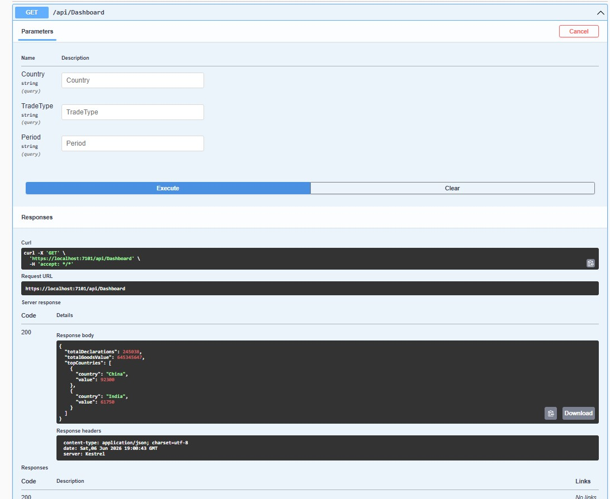

## API Verification

The dashboard endpoint can be tested through Swagger UI.

### Dashboard Endpoint

GET /api/dashboard

The endpoint returns dashboard metrics including:
- Total declarations
- Total goods value
- Top countries
- Dashboard filter parameters (Country, TradeType, Period)