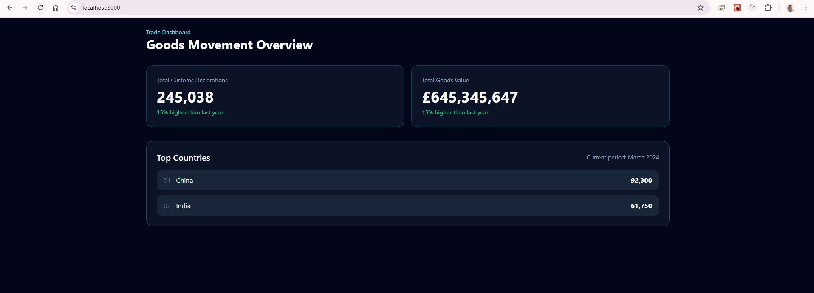

## API Verification

The dashboard endpoint can be tested through Swagger UI.

### Dashboard Endpoint

GET /api/dashboard


The endpoint returns dashboard metrics including:
- Total declarations
- Total goods value
- Top countries
- Dashboard filter parameters (Country, TradeType, Period)


# Milestone 1 - Frontend to Backend Integration

## Overview

The first version of the Trade Dashboard has been completed and demonstrates successful communication between the React frontend and the .NET backend API.

This milestone validates the core architecture of the solution and confirms that the frontend can successfully retrieve and display data from the backend service.

---

## Architecture

```text
React (Vite + TypeScript)
        ↓
Axios
        ↓
.NET Web API
        ↓
IDashboardDataProvider
        ↓
JsonDashboardDataProvider
```

---

## Backend Features Implemented

### Solution Structure

```text
Deloitte.TradeDashboard.sln

src/
├── Deloitte.TradeDashboard.Api
├── Deloitte.TradeDashboard.Application
├── Deloitte.TradeDashboard.Domain
└── Deloitte.TradeDashboard.Infrastructure
```

### Implemented Components

- Clean Architecture structure
- Domain layer
- Application layer contracts and DTOs
- Infrastructure provider pattern
- ASP.NET Core Web API
- Swagger/OpenAPI documentation
- Dependency Injection
- Replaceable data provider architecture

### API Endpoint

```http
GET /api/dashboard
```

### Sample Response

```json
{
  "totalDeclarations": 245038,
  "totalGoodsValue": 645345647,
  "topCountries": [
    {
      "country": "China",
      "value": 92300
    },
    {
      "country": "India",
      "value": 61750
    }
  ]
}
```

---

## Frontend Features Implemented

### Technology Stack

- React
- TypeScript
- Vite
- Tailwind CSS
- Axios

### Implemented Components

- Dashboard page
- API client
- KPI summary cards
- Top countries section
- Responsive layout
- Backend integration

### Dashboard Metrics Displayed

- Total Customs Declarations
- Total Goods Value
- Top Countries

---

## Screenshot

### Frontend Successfully Connected to Backend API

```text
docs/screenshots/frontend-api-integration.png
```



The screenshot demonstrates:

- React application running successfully
- Data retrieved from the .NET API
- KPI cards populated from API response
- Top countries displayed dynamically
- End-to-end frontend and backend communication working correctly

---

## Design Decisions

### Provider Pattern

The backend uses a provider abstraction:

```csharp
public interface IDashboardDataProvider
{
    Task<DashboardResponse> GetDashboardAsync(
        DashboardQuery query,
        CancellationToken cancellationToken);
}
```

Current implementation:

```text
JsonDashboardDataProvider
```

Future implementation:

```text
AdomdDashboardDataProvider
```

This approach allows the underlying data source to be replaced without impacting the API contract or frontend implementation.

---

## Completed Milestone

- ✅ Clean Architecture established
- ✅ Backend API implemented
- ✅ Swagger configured
- ✅ Dependency Injection configured
- ✅ Dashboard endpoint operational
- ✅ React application created
- ✅ Axios API client configured
- ✅ Frontend successfully connected to backend
- ✅ Dashboard data rendered dynamically

---

## Next Steps

### Milestone 2 - Dashboard Filtering

- Country filter
- Trade Type filter
- Period filter
- Dynamic API query parameters

### Milestone 3 - Visual Dashboard

- Interactive world map
- Country bubbles
- Charts and visualisations
- Advanced dashboard styling

### Milestone 4 - Data Layer Enhancement

- JSON file data source
- Data transformation layer
- ADOMD.NET provider implementation (optional)

---

## Status

Milestone 1 completed successfully.

The application now demonstrates a fully functioning end-to-end flow from React frontend to .NET backend using a clean and extensible architecture.
