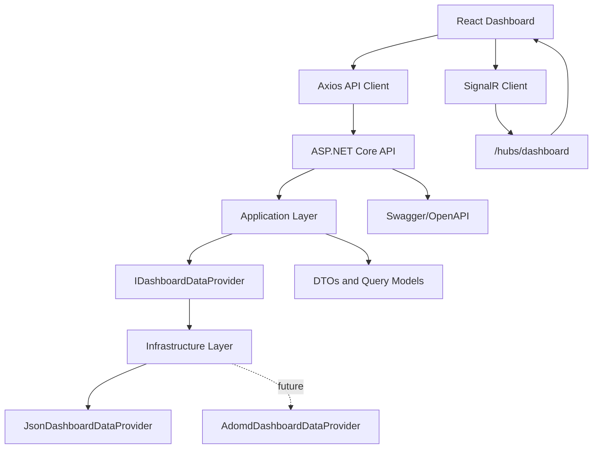
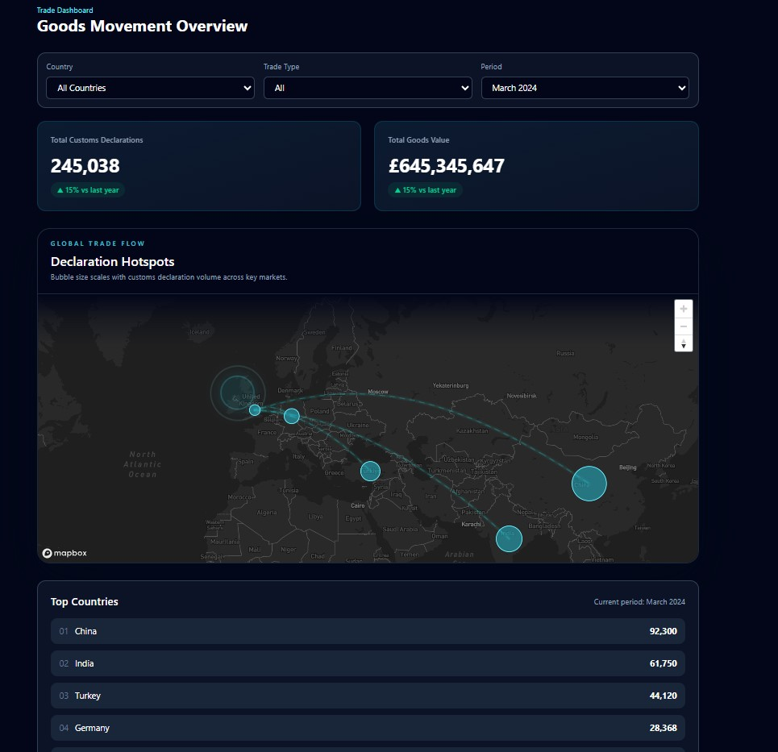

# Deloitte Trade Dashboard

## Project Overview


Deloitte Trade Dashboard is a full-stack trade intelligence application created as a technical assessment to demonstrate practical engineering capability across backend architecture, frontend experience design, real-time communication, and deployment readiness.

The application presents trade performance data through a responsive executive dashboard that combines KPI cards, country rankings, filterable data views, and an interactive Mapbox-powered world map. It is designed to simulate how customs, trade operations, or cross-border logistics teams could monitor declarations, goods value, and country activity from a single operational view.

From a business perspective, the dashboard addresses a common problem: trade data is often fragmented across disconnected reports, static spreadsheets, and delayed operational systems. This project shows how a modern web platform can centralize that information into an accessible, near real-time interface for decision-makers.

The project was built to demonstrate:

- End-to-end full-stack implementation using ASP.NET Core and React.
- Clean Architecture and separation of concerns.
- Replaceable backend data providers using the Provider Pattern.
- Real-time dashboard refresh with SignalR.
- Internationalised UI support with English, French, and Arabic.
- Production-oriented environment configuration for frontend and backend deployment.

## Features

### Backend

- ASP.NET Core Web API targeting .NET 10.
- Clean Architecture-inspired project separation.
- Domain layer for core business entities.
- Application layer for contracts, DTOs, and request/response models.
- Infrastructure layer for concrete data provider implementations.
- Dependency Injection for provider registration and service composition.
- Swagger / OpenAPI for development-time API discovery.
- Provider Pattern through `IDashboardDataProvider`.
- DTO-based API contracts for dashboard metrics and map points.
- Environment-specific configuration via `appsettings.json` and `appsettings.Development.json`.
- Static asset hosting from the API via `wwwroot`.
- CORS policy configured for local React development.

### Frontend

- React 19 application built with Vite.
- TypeScript for typed UI and API contracts.
- Tailwind CSS 4 styling.
- Axios-based API client abstraction.
- Responsive executive dashboard layout.
- Dashboard filters for country, trade type, and period.
- KPI cards for goods value and customs declarations.
- Top countries panel.
- Language selector for English, French, and Arabic.
- Environment-based configuration for API, SignalR hub, and Mapbox token.
- i18next-based localisation with browser language detection.
- RTL layout switching for Arabic.

### Map Visualisation

- Mapbox GL interactive map rendering.
- Country trade bubbles sized by trade value.
- Country markers sourced dynamically from the API.
- Animated trade routes rendered as curved arcs.
- Route glow effects layered for a high-contrast executive display.
- Saudi Arabia origin halo used as the trade route origin focus.
- Dynamic map refresh when dashboard data changes.

### Real-Time Features

- SignalR hub for server-to-client broadcasts.
- Live dashboard updates through the `DashboardUpdated` event.
- Simulated dashboard updates via an API endpoint.
- Real-time KPI refresh without page reload.
- Real-time map refresh for bubbles and trade routes.
- Automatic client reconnect behavior in the frontend SignalR client.

## Architecture

### High-Level Flow



### Layer Responsibilities

#### API Layer

The API project is the composition root of the solution. It exposes REST endpoints, hosts the SignalR hub, configures Swagger, wires dependency injection, applies CORS policy, and serves static frontend assets from `wwwroot`.

#### Application Layer

The Application project defines the use-case-facing contracts and transport models. It contains:

- `IDashboardDataProvider` for abstraction over data access.
- `DashboardQuery` for filter input.
- `DashboardResponse`, `CountryMetricDto`, and `MapPointDto` for API output.

This layer keeps the API surface independent from infrastructure concerns.

#### Domain Layer

The Domain project contains the core business entities and the conceptual shape of trade dashboard data. It represents the central business model without taking a dependency on UI, hosting, or data source implementation details.

#### Infrastructure Layer

The Infrastructure project contains concrete provider implementations. The current implementation uses `JsonDashboardDataProvider` to return representative dashboard data and map points. A placeholder `AdomdDashboardDataProvider` is already present to show the intended path for enterprise data-source integration.

### Architectural Notes

- The frontend depends only on API contracts, not infrastructure details.
- The API depends on an abstraction (`IDashboardDataProvider`), not a concrete data source.
- Replacing JSON data with ADOMD.NET, SAS, or another enterprise source should not require API contract changes.
- SignalR is additive to the REST API, not a replacement for it.

## Technology Stack

### Backend

- .NET 10 currently targeted, aligned with modern .NET 9 / .NET 10 ASP.NET Core patterns.
- ASP.NET Core Web API.
- SignalR.
- Swagger / Swashbuckle.

### Frontend

- React.
- TypeScript.
- Vite.
- Tailwind CSS.
- Axios.
- Mapbox GL.
- i18next.

### Development Tools

- Git.
- GitHub.
- Visual Studio.
- Visual Studio Code.
- GitHub Copilot.

## Solution Structure

The repository is organised as a multi-project solution with the backend separated into API, application, domain, and infrastructure concerns, plus a dedicated frontend application.

```text
.
├── Deloitte.slnx
├── readme.md
├── docs/
│   └── screenshots/
├── Deloitte.TradeDashboard.Api/
├── Deloitte.TradeDashboard.Application/
├── Deloitte.TradeDashboard.Domain/
├── Deloitte.TradeDashboard.Infrastructure/
└── trade-dashboard-ui/
```

### Project Responsibilities

#### Deloitte.TradeDashboard.Api

Backend host application.

- Exposes `/api/dashboard` endpoints.
- Hosts the SignalR hub at `/hubs/dashboard`.
- Configures DI, Swagger, CORS, static file hosting, and environment-based runtime behavior.

#### Deloitte.TradeDashboard.Application

Application contracts and DTOs.

- Request and response models.
- Provider abstraction.
- Use-case-facing transport contracts.

#### Deloitte.TradeDashboard.Domain

Core domain model.

- Trade entities.
- Conceptual business data structures.
- Business-centric types independent of infrastructure.

#### Deloitte.TradeDashboard.Infrastructure

Concrete data access and provider implementations.

- JSON-backed dashboard provider.
- Data payload source files.
- Future enterprise provider placeholder for ADOMD.NET integration.

#### trade-dashboard-ui

Frontend client application.

- React + TypeScript + Vite application.
- Dashboard page, KPI cards, filters, map visualisation, language selector, and SignalR client integration.

## API Documentation

### GET /api/dashboard

Returns the current dashboard payload and supports optional query parameters.

#### Query Parameters

- `country`
- `tradeType`
- `period`

#### Example Request

```http
GET /api/dashboard?country=China&tradeType=Import&period=2024-03
```

#### Example Response

```json
{
  "totalDeclarations": 245038,
  "totalGoodsValue": 645345647,
  "topCountries": [
    {
      "country": "China",
      "value": 92300
    },
    {
      "country": "India",
      "value": 61750
    },
    {
      "country": "Turkey",
      "value": 44120
    },
    {
      "country": "United States",
      "value": 38000
    },
    {
      "country": "Japan",
      "value": 34000
    }
  ],
  "mapPoints": [
    {
      "country": "China",
      "latitude": 35.8617,
      "longitude": 104.1954,
      "value": 92300
    },
    {
      "country": "Saudi Arabia",
      "latitude": 23.8859,
      "longitude": 45.0792,
      "value": 18500
    }
  ]
}
```

### POST /api/dashboard/simulate-update

Generates a simulated refresh of dashboard values and broadcasts the result to connected SignalR clients using the `DashboardUpdated` event.

#### Example Request

```http
POST /api/dashboard/simulate-update?period=2024-03
```

#### Example Response

```json
{
  "totalDeclarations": 253441,
  "totalGoodsValue": 661872904,
  "topCountries": [
    {
      "country": "China",
      "value": 96740
    },
    {
      "country": "India",
      "value": 60411
    },
    {
      "country": "Turkey",
      "value": 45098
    }
  ],
  "mapPoints": [
    {
      "country": "China",
      "latitude": 35.8617,
      "longitude": 104.1954,
      "value": 96740
    },
    {
      "country": "Saudi Arabia",
      "latitude": 23.8859,
      "longitude": 45.0792,
      "value": 19124
    }
  ]
}
```

### SignalR Hub

#### Endpoint

```text
/hubs/dashboard
```

#### Broadcast Event

```text
DashboardUpdated
```

Connected clients subscribe to `DashboardUpdated` and refresh KPI cards, top-country data, and map visualisation in real time.

## Dashboard Screens

### Dashboard Overview

The main screen combines navigation, KPI cards, a world map, live connection status, filters, and a ranked country panel into a single executive-style operational layout.



### KPI Cards

The dashboard highlights total goods value and total customs declarations as top-level KPIs, making it easy to assess current trade activity at a glance.

### Map Visualisation

The Mapbox experience renders live country markers, scaled trade bubbles, route arcs, route glow layers, and a Saudi Arabia origin halo to visually communicate trade flow.


### Trade Routes

Curved trade routes are drawn dynamically from the origin point to destination countries returned by the API, producing a clear visual representation of international movement.

### Top Countries Panel

The lower dashboard panel displays top countries together with filtering controls for country, trade type, and period.

### Language Selector

The interface includes a language toggle for English, French, and Arabic, with Arabic also switching the page direction to RTL.

### Filters

The dashboard supports:

- Country filter.
- Trade type filter.
- Period filter.


## Real-Time Updates

Real-time behavior is implemented using SignalR with a simple broadcast model.

### SignalR Architecture

```text
React Client
    ↓ connects to
SignalR Hub (/hubs/dashboard)
    ↑ broadcast from
ASP.NET Core API
    ↑ triggered by
POST /api/dashboard/simulate-update
```

### Broadcast Flow

1. The frontend establishes a SignalR connection on page load.
2. The API exposes `/api/dashboard/simulate-update` for demo purposes.
3. The API retrieves the current dashboard state from the configured provider.
4. The API generates updated KPI and map values.
5. The API broadcasts the payload to all connected clients with `DashboardUpdated`.
6. The React client updates the KPI cards, top-country panel, and map without a page refresh.

### DashboardUpdated Event

The event name used by both backend and frontend is:

```text
DashboardUpdated
```

### Simulated Update Endpoint

The simulated update endpoint exists to demonstrate real-time behavior in a self-contained technical assessment without requiring a live streaming enterprise data source.

## Internationalisation

The dashboard supports three languages:

- English (`en`)
- French (`fr`)
- Arabic (`ar`)

Internationalisation is implemented with `i18next`, `react-i18next`, and browser language detection.

### RTL Support

When Arabic is selected, the application updates:

- `document.documentElement.lang`
- `document.documentElement.dir`

This enables RTL-aware styling for dashboard components such as country rows, filter controls, and layout-aligned elements.

## Environment Variables

The frontend uses Vite environment variables for runtime integration.

### Required Variables

- `NEXT_PUBLIC_CLARITY_ID`
- `VITE_API_BASE_URL`
- `VITE_SIGNALR_HUB_URL`
- `VITE_MAPBOX_TOKEN`

### Development Example

```env
NEXT_PUBLIC_CLARITY_ID=your_clarity_project_id
VITE_API_BASE_URL=https://localhost:7260
VITE_SIGNALR_HUB_URL=/hubs/dashboard
VITE_MAPBOX_TOKEN=your-mapbox-public-token
```

### Production Example

```env
NEXT_PUBLIC_CLARITY_ID=your_clarity_project_id
VITE_API_BASE_URL=https://trade-dashboard.mpa-demo.co.uk
VITE_SIGNALR_HUB_URL=/hubs/dashboard
VITE_MAPBOX_TOKEN=your-mapbox-public-token
```

### Backend Configuration

Backend configuration is managed through:

- `appsettings.json`
- `appsettings.Development.json`
- ASP.NET Core environment settings

## Local Development

### Frontend

```bash
cd trade-dashboard-ui
npm install
npm run dev
```

The Vite development server runs the React UI locally, typically on `http://localhost:5173`.

### Backend

```bash
dotnet restore
dotnet build
dotnet run --project Deloitte.TradeDashboard.Api
```

## Running Backend Tests

```bash
dotnet test
```

The API hosts:

- REST endpoints under `/api`
- Swagger in development under `/swagger`
- SignalR hub at `/hubs/dashboard`

### Recommended Development Workflow

Run the backend and frontend in parallel:

1. Start the ASP.NET Core API.
2. Start the Vite frontend.
3. Open the frontend in the browser.
4. Use the simulate update action to verify real-time SignalR behavior.

## Production Deployment

The solution supports a straightforward production deployment model where the React frontend is built and deployed as static assets served by ASP.NET Core.

### Vite Build

```bash
cd trade-dashboard-ui
npm run build
```

This produces an optimized frontend bundle and writes it directly into `Deloitte.TradeDashboard.Api/wwwroot`.

### ASP.NET Core Hosting

The API is configured with:

- `UseDefaultFiles()`
- `UseStaticFiles()`
- `MapFallbackToFile("index.html")`

That allows the backend to serve the SPA from `wwwroot` in a single-host deployment model.

### wwwroot Deployment

For single-site hosting, the built frontend assets should be published into the API application's `wwwroot` folder as part of the release pipeline.

### IIS Deployment

This solution is suitable for IIS-hosted deployment of the ASP.NET Core application, with the React bundle served as static files from the same site.

#### Microsoft Clarity Setup

Microsoft Clarity is loaded globally for the React application and only activates when `NEXT_PUBLIC_CLARITY_ID` is set during the frontend build.

1. Create or open your project in [Microsoft Clarity](https://clarity.microsoft.com/).
2. Add your deployed site `https://trade-dashboard.mpa-demo.co.uk`.
3. Copy the Clarity Project ID from the installation snippet.
4. Set `NEXT_PUBLIC_CLARITY_ID` in the frontend build environment, for example in `trade-dashboard-ui/.env.production`.

Example:

```env
NEXT_PUBLIC_CLARITY_ID=your_clarity_project_id
VITE_API_BASE_URL=https://trade-dashboard.mpa-demo.co.uk
VITE_SIGNALR_HUB_URL=/hubs/dashboard
VITE_MAPBOX_TOKEN=your-mapbox-public-token
```

Clarity is not loaded at all when `NEXT_PUBLIC_CLARITY_ID` is missing or empty.

#### Rebuild And Publish For IIS

Run the frontend build first so the generated assets are placed into the API `wwwroot` folder:

```powershell
cd trade-dashboard-ui
npm install
npm run build
```

Then publish the ASP.NET Core application:

```powershell
dotnet publish .\Deloitte.TradeDashboard.Api\Deloitte.TradeDashboard.Api.csproj -c Release -o .\publish
```

Copy the contents of the `publish` folder to your IIS site folder. That is the safest deployment unit because it includes:

- the ASP.NET Core host binaries
- `web.config` if generated by publish
- the updated `wwwroot` folder
- the latest React static assets

If you use a manual copy process instead of `dotnet publish`, at minimum copy the refreshed `Deloitte.TradeDashboard.Api/wwwroot` contents together with the backend deployment artifacts expected by your IIS site.

#### Verify Clarity In Production

After deployment:

1. Open `https://trade-dashboard.mpa-demo.co.uk`.
2. Open browser DevTools.
3. In the `Network` tab, filter by `clarity` or `collect`.
4. Confirm requests are sent to `clarity.ms/collect`.
5. Check the Clarity dashboard for incoming sessions, devices, page views, and visitor recordings.

#### Sensitive Field Guidance

The current dashboard UI does not include free-text or credential fields. If you add sensitive forms later, mask them explicitly with `data-clarity-mask="true"` on the field or containing element before shipping the change.

### Environment Variables

For production deployments, configure:

- Frontend Vite variables during build.
- ASP.NET Core environment settings on the host.
- Any CORS or domain-specific adjustments required by the final hosting topology.

## Design Decisions

### Provider Pattern

The Provider Pattern was selected to decouple dashboard retrieval from the API layer. This enables a simple JSON-backed implementation for the assessment while preserving a clean migration path to enterprise data providers such as ADOMD.NET.

### Clean Architecture

The solution separates API, application contracts, domain model, and infrastructure concerns to keep responsibilities clear, improve maintainability, and reduce coupling between business logic and implementation details.

### Why SignalR Was Used

SignalR was chosen to demonstrate real-time delivery of dashboard updates. It is appropriate for operational dashboards where users expect fresh metrics and visual state changes without manual refresh.

### Why Mapbox Was Used

Mapbox GL provides a flexible, visually rich mapping engine suitable for bubble overlays, route animation, styling control, and executive-grade visual presentation.

### Why React + TypeScript Was Selected

React and TypeScript offer a strong balance of developer productivity, component reusability, and type safety. For a dashboard application with API integration, filtering logic, map interactions, and real-time events, that combination keeps the frontend maintainable as complexity grows.

## Future Enhancements

- ADOMD.NET integration for enterprise analytical data access.
- SAS data source integration.
- Authentication and identity integration.
- Role-based security and authorization.
- Historical analytics and trend visualisations.
- Advanced charts and richer comparative analytics.
- Data export to CSV, Excel, or PDF.
- Audit logging for administrative and operational traceability.

## Milestones

### Milestone 1

Frontend ↔ Backend Integration

- Connected the React frontend to the ASP.NET Core API.
- Established the initial dashboard contract and data flow.

### Milestone 2

Dashboard Filters

- Added country filtering.
- Added trade type filtering.
- Added period selection.

### Milestone 3

Mapbox Visualisation

- Introduced an interactive world map.
- Added trade bubbles and country markers.
- Added animated route rendering.

### Milestone 4

SignalR Real-Time Updates

- Added the dashboard SignalR hub.
- Implemented the simulated update endpoint.
- Enabled live UI refresh for KPI and map data.

### Milestone 5

Internationalisation

- Added English, French, and Arabic translations.
- Implemented Arabic RTL switching.

### Milestone 6

Production Deployment

- Prepared the frontend for optimized Vite builds.
- Configured the API to serve SPA assets from `wwwroot`.
- Established a single-host deployment path suitable for IIS.

## Key Learning Outcomes

This project demonstrates applied capability in:

- Architecture: structuring a multi-project solution with clear boundaries.
- Real-time systems: integrating SignalR for live operational dashboards.
- Frontend engineering: building a responsive, interactive, multilingual React application.
- API design: exposing clean DTO-based endpoints with a replaceable backend provider.
- Deployment: preparing a modern SPA + ASP.NET Core hosting model.
- Environment management: separating runtime configuration for local and production usage.

## Author

Tony Cruz  
Senior Full Stack .NET Developer

https://clarity.microsoft.com/projects/view/x3iaygs685/impressions?date=Last%203%20days&view=liveRecordings&list=0
